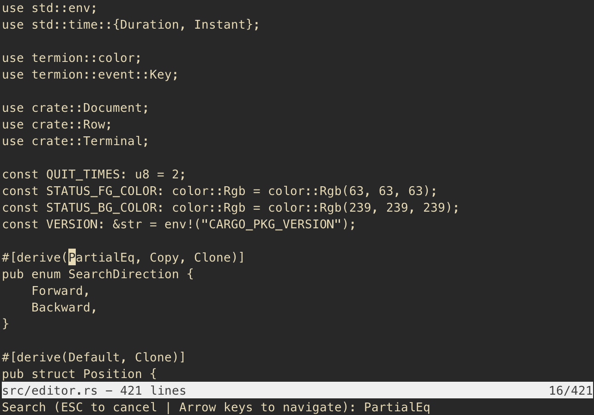

# Rusty Edits


Rusty Edits is a simple, vi-like text editor written in Rust.



## Requirements
- Rust (1.49.0+)
- Cargo (1.49.0+)

## Instructions
You can build and run the text editor using the following command:
```rust
cargo run
```

To open a specific file, you may pass in the filename as an argument:
```rust
cargo run src/editor.rs
```

## Keyboard Shorcuts
- `Arrow Keys` &rarr; move cursor in the specified direction
- `Page Up` / `Page Down` &rarr; scroll up or down a page
- `Home` / `End` &rarr; move cursor to the start or end of the line
- `Ctrl + f` &rarr; search the file for a provided query
  - `Up Arrow` / `Left Arrow` &rarr; navigate to previous match
  - `Down Arrow` / `Right Arrow` &rarr; navigate to next match
- `Ctrl + s` &rarr; save the file
- `Ctrl + q` &rarr; quit the text editor
